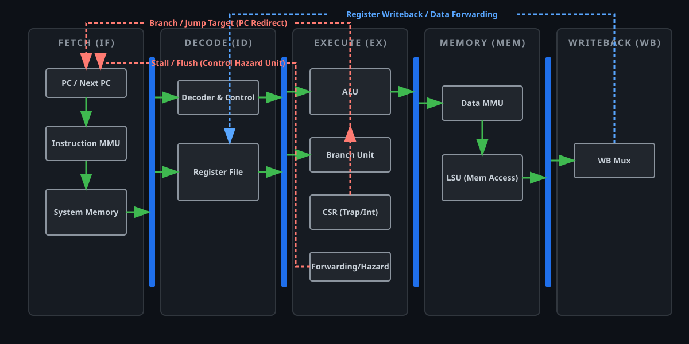

# OpenRISC-64 (Custom RV64 Core)

A custom 64-bit single-core RISC-V processor designed from scratch in SystemVerilog. Built with a modular architecture intended to serve as a building block for future multi-core scaling.

100% open-source, non-proprietary, and built strictly using free, open-source EDA tools.

[ROADMAP](ROADMAP.md)

  

## Key Architecture Goals

* **Architecture:** RISC-V 64-bit Base (RV64I)
* **Design Philosophy:** Clean, modular single-core pipeline structured for seamless tile/interconnect integration into future multi-core clusters.
* **Target Execution:** Full simulation via Verilator & C++ testbenches, FPGA prototyping, and eventual tape-out (e.g., Tiny Tapeout / SkyWater 130nm).
* **OS Target:** Designed to support privilege modes ($M, S, U$) and SV39 MMU for Linux/Unix compatibility.

## Tech Stack & Tooling

* **HDL:** SystemVerilog
* **Simulation & Testing:** Verilator, GTKWave, C++ Testbenches
* **Synthesis & PnR:** Yosys, nextpnr (OSS CAD Suite)
* **Compiler Toolchain:** `riscv64-unknown-elf-gcc`
  
# License

This project is licensed under the MIT License - see the LICENSE file for details.
